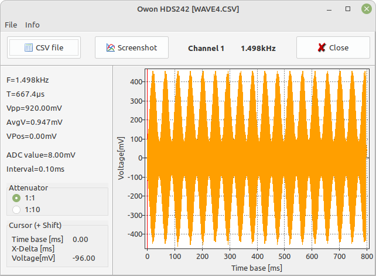
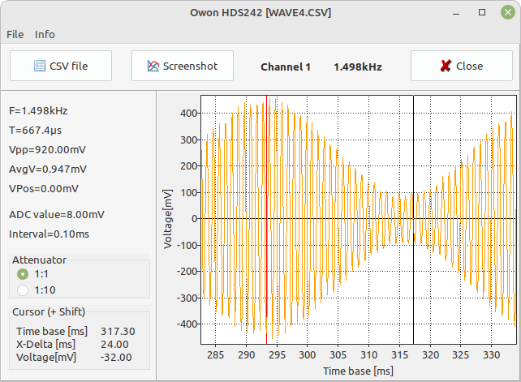

# OwonOszi

Show CSV files with saved waveforms from handheld oscilloscope HDS242.
You now can see the waveforms on a larger screen and zoom into it.
Zoom with mouse wheel, pan with Left mouse button, cursors with Left mouse button + Shift.

With cursors you can measure intervals:
1. Place Red cursor somewhere with Left mouse button + Shift. Let it go.
2. Move mouse to another place and switch cursor on with
   Left mouse button + Shift: X-Delta shows the interval between the two cursors.

Because HDS242 has a limited number of filenames you can save a copy of the CSV-files with a unique file name.
